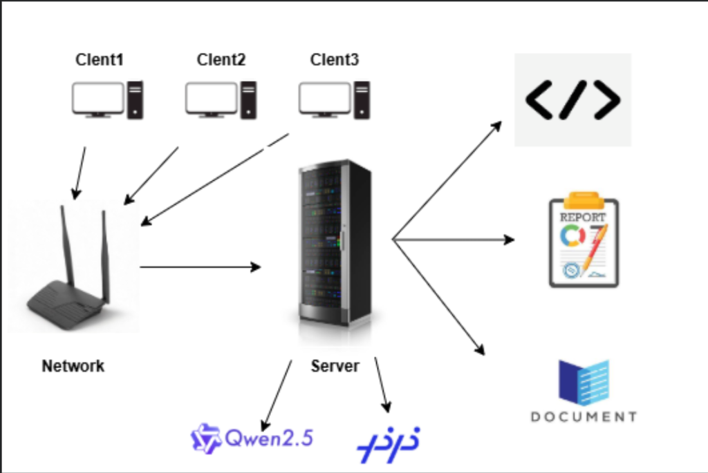
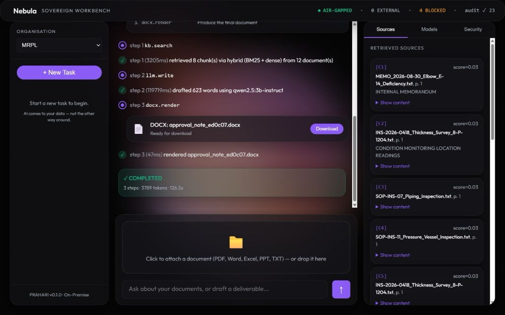
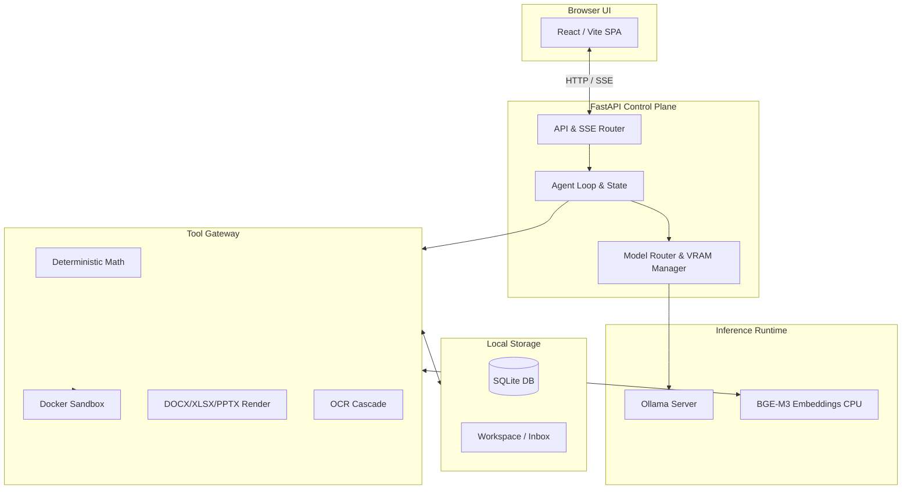
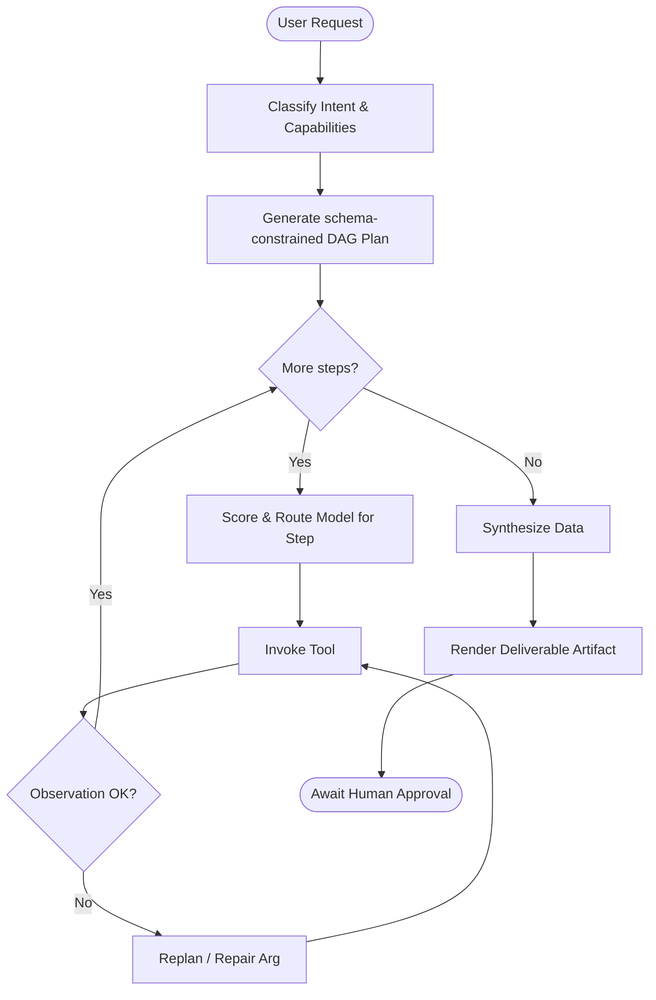
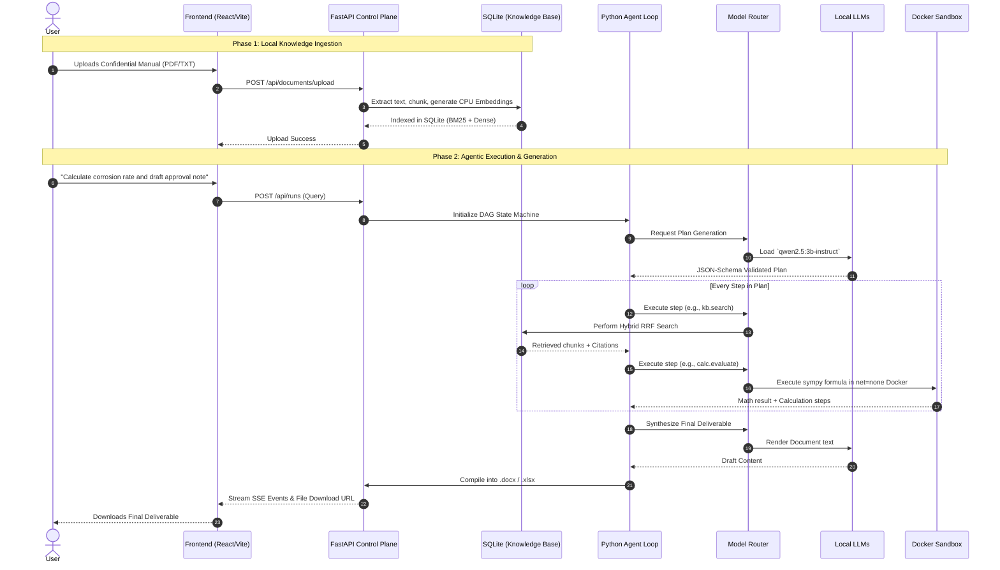
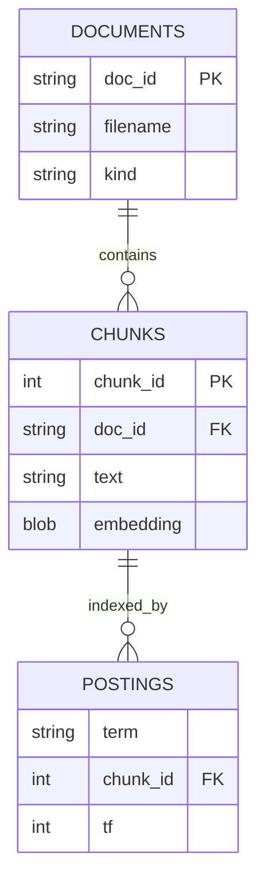
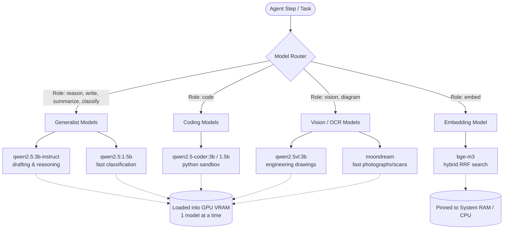

# PRAHARI: Sovereign On-Premise Agentic AI Workbench

> **AI comes to your data — not the other way around.**

<p align="center">
  
  &nbsp;
  
</p>

PRAHARI is a self-hosted, air-gapped, agentic AI workbench built for confidential industrial work in refineries, PSUs, and defense units.

## 1. Project Overview

Refineries and defense units generate highly sensitive routine work—approval notes, P&ID reviews, engineering calculations, and vendor strategies. Because this data is confidential, using cloud AI assistants like Claude or ChatGPT poses severe data-exfiltration risks ("shadow AI").

PRAHARI solves this by bringing the AI to the data. It is a completely on-premise, multi-model AI assistant that plans multi-step work, interacts with local tools (sandbox, file I/O, deterministic math, internal document search), and generates real deliverables (Word, Excel, PPT files) without making a single external API call.

## 2. Key Features

* **100% Sovereign & Air-Gapped:** Structural egress guards and `net=none` sandboxes ensure no data leaves the machine.
* **Dynamic Model Routing:** Automatically loads and unloads open-weight models (Qwen2.5, Moondream, BGE-m3) per *step* of a task, governed by a strict VRAM budget manager.
* **Agentic Workflows with Bounded Control:** The LLM fills parameters and judges outcomes, but the control flow and tool dispatch are executed by a strict Python DAG (Directed Acyclic Graph) loop.
* **Hybrid Knowledge Retrieval:** Local indexing with SQLite using BM25 (sparse) and CPU-based BGE-m3 (dense) embeddings, fused via Reciprocal Rank Fusion (RRF).
* **Deterministic Math Engine:** Uses `sympy` and `pint` for domain-specific formulas (e.g., corrosion rate) instead of hallucination-prone LLM arithmetic.
* **Real Deliverables:** Compiles the agent's findings, calculations, and citations into natively formatted `.docx`, `.xlsx`, and `.pptx` files.

## 3. System Workflow

1. **RECEIVE:** The system receives a user request and attachments via the frontend.
2. **CLASSIFY:** A fast model classifies the intent, required modalities, and the expected deliverable type.
3. **PLAN:** The agent generates a strict JSON-Schema-validated plan (or selects a predefined recipe template).
4. **SELECT & EXECUTE (Iterative):** For each step in the plan, the router selects the best model, swaps it into VRAM if necessary, and executes the tool (e.g., `kb.search`, `calc.evaluate`, `ocr.page`).
5. **OBSERVE & CRITIC:** The system observes the tool's output. If validation fails, the agent attempts a bounded repair.
6. **SYNTHESIZE & DELIVER:** Once the plan is complete, the agent synthesizes the results and generates the final requested artifact (e.g., a Word Document).

## 4. High-Level Architecture



## 5. Detailed Architecture & Component Design

* **FastAPI Backend (`prahari/main.py`):** The control plane. Exposes REST endpoints and SSE streams to track agent progress. It binds exclusively to `127.0.0.1`.
* **Model Router & VRAM Manager (`prahari/router/`):** Evaluates models against a given task step (scoring quality, context size, and VRAM swap latency penalties). It orchestrates loading models into Ollama on the fly.
* **Agent Loop (`prahari/agent/loop.py`):** Enforces a `RECEIVE → CLASSIFY → PLAN → [EXECUTE]* → DELIVER` state machine. It prevents infinite agent loops by strictly limiting retries and wall-clock time. 
* **Knowledge Store (`prahari/knowledge/store.py`):** A custom SQLite implementation for vector search. Avoids the overhead of external vector DB services (like Qdrant) while maintaining high-performance hybrid RRF search isolated by `org_id`.
* **Docker Sandbox (`prahari/tools/code_sandbox.py`):** Runs Python code generated by the agent in an ephemeral, stripped-down Alpine container with `--network none` and `--security-opt no-new-privileges`.
* **Security & Egress Guard (`prahari/api/security.py`):** Validates air-gap status by actively probing for egress capabilities and logging security states.

## 6. Flowcharts

**Agent Execution Protocol:**


## 7. End-to-End Design Flow Architecture

The following sequence diagram illustrates the end-to-end architectural flow of how a user's prompt is processed, from data ingestion to final deliverable generation, ensuring a completely air-gapped lifecycle.



## 8. Technology Stack

* **Frontend:** React, Vite, Vanilla CSS.
* **Backend:** Python 3.11, FastAPI, SSE (Server-Sent Events).
* **AI & Inference:** Ollama (Native), Qwen2.5 suite (`1.5b`, `3b-instruct`, `coder`, `vl`), Moondream, BGE-m3.
* **Data Storage & Knowledge Base:** SQLite (with custom Numpy vector dot-product queries).
* **Execution Sandbox:** Docker.
* **Calculations & Data:** `sympy`, `pint` (units), `python-docx`, `python-pptx`, `openpyxl`.

## 9. Project Structure

```text
SIH-2026/
├── backend/
│   └── prahari/
│       ├── agent/        # Loop, planner, recipes, schemas
│       ├── api/          # FastAPI routes (security, runs, documents)
│       ├── knowledge/    # Chunking, ingestion, hybrid SQLite store
│       ├── llm/          # Ollama client wrappers
│       ├── router/       # VRAM manager, registry, deterministic scorer
│       ├── tools/        # Tools: sandbox, deliverables, calc, files
│       └── main.py       # API Application entry point
├── frontend/
│   ├── src/
│   │   ├── components/   # React UI components (Sidebar, Timeline, Inspector)
│   │   ├── hooks/        # SSE streaming hooks
│   │   └── lib/          # API utilities
│   └── vite.config.js    # Vite configuration
├── config/               # models.yaml, profiles.yaml
├── data/                 # Local persistence (org data, sqlite db, inboxes, workspaces)
├── scripts/              # Utility scripts for CLI execution & testing
└── README.md
```

## 10. API / Backend Overview

* **`POST /api/runs`**: Starts a new agentic run with a prompt and history.
* **`GET /api/runs/{id}/events`**: SSE stream that emits lifecycle events (stage started, tool invoked, observation, artifact created).
* **`GET /api/models`**: Lists available models, their VRAM footprints, and the current residency state.
* **`POST /api/documents/upload`**: Uploads and immediately indexes a document into the SQLite store.
* **`GET /api/security/status`**: Reports the live audit count and external API call count (which is structurally guaranteed to be 0).

## 11. Database / Storage Architecture

PRAHARI utilizes **SQLite** for knowledge base and metadata storage, isolated per organization (`org_id`).
* **`documents`**: Tracks file metadata, ingestion time, and chunk counts.
* **`chunks`**: Stores raw text, page numbers, bounding boxes, and BLOBs of numpy float32 dense embeddings.
* **`postings`**: An inverted index table for BM25 term frequencies (`term`, `chunk_id`, `tf`).



## 12. AI/ML Architecture

### Model Routing & LLM Usage
PRAHARI uses a dynamic **VRAM Manager** and **Model Router** that automatically hot-swaps models inside Ollama based on the specific capability required for each step of the plan. This allows running multiple specialized models sequentially on a single 6GB mid-range GPU.



* **No Fine-Tuning:** The models are strictly open-weight generalists. Domain knowledge lives in the RAG pipeline, preventing knowledge staleness.
* **Structured Output:** All LLM plans and classifications are forced into valid JSON using Ollama's schema constraint API.
* **VRAM Manager:** Manages the constraints of mid-range GPUs (e.g., RTX 3050 6GB) by executing only one generative model at a time. It uses a custom scoring formula:
  `score = quality + fits_context + speed - swap_cost - vram_pressure`.
* **CPU Embeddings:** `bge-m3` is pinned to the CPU to reserve precious GPU VRAM exclusively for generative models.

## 13. Security Architecture

* **Network Isolation:** No `http.get`, `email.send`, or shell tools exist in the tool registry. The application drops external calls (`HF_HUB_OFFLINE`, `TRANSFORMERS_OFFLINE`).
* **Code Sandbox:** Docker container uses `--network none`, `--cap-drop ALL`, and runs as a non-root user.
* **No Telemetry:** Telemetry for all standard dependencies is programmatically disabled.
* **Workspace Jailing:** File modifications are strictly contained within `data/orgs/<org_id>/workspace/`.

## 14. Deployment & Infrastructure

The application runs locally without cloud dependencies.
* **Backend Engine:** Runs natively on the host machine using Python 3.11+.
* **Frontend:** Served via Node/Vite development server (or built as static assets).
* **Inference:** Requires an active `ollama` daemon running on `127.0.0.1`.
* **Isolation:** Requires Docker daemon to spawn ephemeral sandbox containers for code execution.

## 15. Setup & Installation

**Prerequisites:**
* Windows/Linux/macOS with a GPU (min 6GB VRAM recommended, CPU fallback works).
* Python 3.11+
* Node.js 18+
* Docker Desktop (for code sandboxing)
* Ollama installed and running.

**1. Pull AI Models (Ollama):**
```bash
ollama pull qwen2.5:1.5b
ollama pull qwen2.5-coder:1.5b
ollama pull bge-m3
```
*(Optionally pull `qwen2.5:3b-instruct` and `qwen2.5vl:3b` if hardware permits).*

**2. Setup Python Backend:**
```bash
python -m venv venv
source venv/bin/activate
pip install -r requirements.txt
```

**3. Setup Frontend:**
```bash
cd frontend
npm install
```

**4. Start the Application:**
```bash
# In the project root
python run_dev.py
```
This script simultaneously launches the FastAPI backend on port 8000 and the Vite frontend on port 3000.

## 16. Usage

1. Open `http://localhost:3000` in your browser.
2. The UI will show a conversational interface.
3. Use the Sidebar to upload confidential documents (e.g., inspection reports, standard operating procedures).
4. Enter a prompt: *"Draft an approval note for the thickness deficiency at Elbow E-14 on line 8-P-1204."*
5. Watch the timeline as the agent classifies the intent, searches the internal SQLite database, calculates corrosion rates using `sympy`, and generates a final `.docx` artifact.
6. Review the artifact using the Inspector pane.

## 17. Design & Engineering Decisions

* **SQLite over Qdrant:** Swapped out Qdrant for SQLite vector/BM25 storage. This eliminates the need for an extra persistent background Docker container, simplifying on-premise installation drastically while keeping data segregated by `org_id`.
* **Schema-Constrained LLMs over Re-prompting:** Uses Ollama's structured output instead of asking the model nicely and looping on failures. Unrepresentable plans cannot be emitted.
* **Deterministic Math over LLM Math:** Implemented `calc.evaluate` via `sympy` and `pint`. Industrial engineers require auditable, repeatable math with explicit units.

## 18. Current Implementation Status

**Fully Implemented:**
* Local FastAPI and React/Vite UI with live SSE streams.
* Agentic Directed Acyclic Graph (DAG) loop with strict `Plan -> Execute -> Critic` workflow.
* Dynamic VRAM-aware model router with hot-swapping via Ollama.
* Deterministic math tool (`sympy`).
* Native deliverable generation (`.docx`, `.xlsx`, `.pptx`).
* Ephemeral Code Sandbox in Docker.
* Custom SQLite hybrid RAG store (BM25 + dense RRF).

**Planned/Future Work:**
* **Role-Based Access Control (RBAC) & User Auth:** Currently missing; single-tenant execution assumed per host.
* **Multi-GPU Scaling:** Currently optimized aggressively for a single mid-range GPU.

## 19. Limitations & Future Improvements

* **Concurrency Limits:** Since only one generative model is loaded into VRAM at a time, simultaneous requests from multiple users will cause significant model thrashing. Future improvements could cluster requests or batch operations.
* **OCR Quality:** Built-in PDF parsing uses `PyMuPDF`. Handling complex, dirty handwritten scans requires the `VL` model, which strains smaller hardware. 
* **Vector Dimensionality:** The SQLite embedding setup is currently hardcoded for `bge-m3` vectors. Swapping to a different embedding model requires wiping the database.

## 20. Hackathon Context (SIH-2026 / SIH26117)

PRAHARI directly answers problem statement **SIH26117**.
* **Requirement:** *Self-hosted, air-gapped AI workbench... nothing leaves the premises.* 
  **Implemented:** Zero external API calls. Egress guards active.
* **Requirement:** *Agentic... iterate on a task... output real deliverables.*
  **Implemented:** Multi-step agent loop rendering Word/Excel files with deterministic calculation steps.
* **Requirement:** *Grounded in org's own manuals.*
  **Implemented:** SQLite Hybrid RRF knowledge base scoped by `org_id`.
* **Requirement:** *Multiple open weight models... automatically pick the right one.*
  **Implemented:** `Router/Scorer` dynamically swaps models per specific DAG step.
